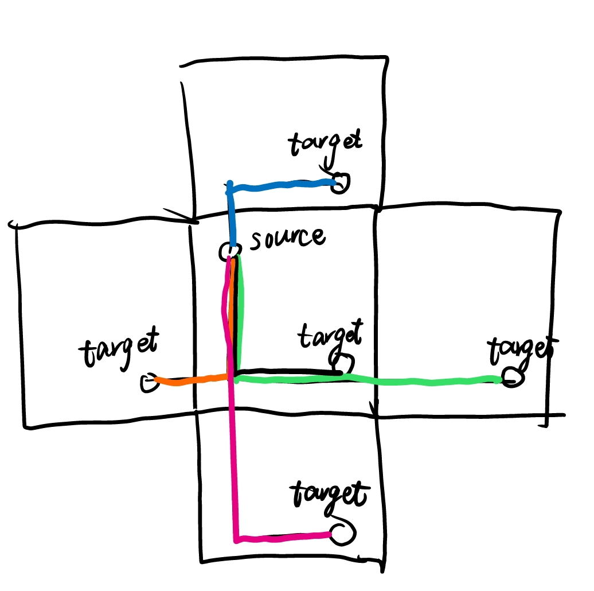

# 实验1.1

## 算法主要思想

A*算法

通过不断对节点的一致性代价g(n)和h(n)相加得到评估结果eval，然后不断选择eval最小的节点进行拓展，来搜索整个状态空间，如果达到目标状态，则为最优解，返回结果节点并返回路径。在此过程中，使用`closed_list`记录已经访问过的节点。如果expand得到的结果eval在closed_list中存在，且小于closed_list中的节点eval,需要从closed_list中消除该点并重新添加到open_list中。如果expand得到的节点在open_list中，且比open_list中的eval要小，则也需要从open_list中删除eval大的节点并插入新节点。

IDA*算法

使用迭代加深的深度优先算法，但是限制深度d_limit=eval,当出现比限制深度d_limit还要大的点eval'时，忽略该点，并且如果eval' < next_d_limit,则将next_d_limit赋值为eval';对于小于限制深度的点，判断是否为目标节点，若是，则返回，否则继续拓展并加入list的top端。当list空时，进行下一轮迭代。整体上通过限制搜索深度防止深度优先的盲目搜索。

启发式函数h2定义为每个星球的绝对曼哈顿距离之和。如下图所示。



对于每个点，假设当前位置为{i, j}, 目标位置为{x, y}
则绝对曼哈顿距离定义为min{|i-x|, 5-|i-x|}+min{|j-y|, 5-|j-y|}

简单来说，就是在边界上将隧道全部打通，飞船可以在任何边界上进行跳跃。

因为每个点必须通过飞船才能移动，而该点到达目标点的最短距离就是上面的绝对曼哈顿距离,
另外，由于飞船每次只能移动一个点，所以不会对其他点有影响。并且由于隧道的位置限制，可能存在弯路的情况。

因此，所有星球的绝对曼哈顿距离之和一定小于真实移动步数。即admissible

## 运行结果

A_h1

| 样例编号 | 运行时间(s)  | 移动序列                             | 移动步数 |
|------|----------|----------------------------------|------|
| 0    | 0.001677 | DDRUR                            | 5    |
| 1    | 0.001601 | ULLUULDD                         | 8    |
| 2    | 0.001167 | DDLUULLURR                       | 10   |
| 3    | 0.00655  | DLDRRURRRUUURR                   | 14   |
| 4    | 0.007314 | LUUURULLURDDRDR                  | 15   |
| 5    | 0.009574 | LLUURRRUURDDDDLUURDD             | 20   |
| 6    | 0.027783 | DRDLLULULUUURDRURDRDRRR          | 23   |
| 7    | 0.004779 | URRRRDLLLLDRRRRDLLLLDRRRR        | 25   |
| 8    | 0.111556 | DLLLDRUUUULDRRRRULDDDDRULDR      | 27   |
| 9    | 1.348464 | RDRDLUUUURRDRDDRUUULLDRULURR     | 28   |
| 10   | 0.074612 | DDRRUUUULLULLUULLLLLUURRDDDDRR   | 30   |
| 11   | 5.364917 | DRUURDRRDRUULDLULDLDRDLDRURDRURD | 32   |

A_h2

| 样例编号 | 运行时间(s)  | 移动序列                             | 移动步数 |
|------|----------|----------------------------------|------|
| 0    | 0.001355 | DDRUR                            | 5    |
| 1    | 0.001449 | ULLUULDD                         | 8    |
| 2    | 0.001091 | DDLUULLURR                       | 10   |
| 3    | 0.0021   | DLDRRURRRUUURR                   | 14   |
| 4    | 0.002092 | LUUURULLURDDRDR                  | 15   |
| 5    | 0.002166 | LLUURRRUURDDDDLUURDD             | 20   |
| 6    | 0.010596 | DRDLLULULUUURDRURDRDRRR          | 23   |
| 7    | 0.00187  | URRRRDLLLLDRRRRDLLLLDRRRR        | 25   |
| 8    | 0.00866  | DRDLULLLDRUUUULDRRRRULDDDRD      | 27   |
| 9    | 0.11677  | RDRDLUUUURRUUURDRUUULDLDDDRR     | 28   |
| 10   | 0.008887 | DDRRUUUULLULLUULLLLLUURRDDDDRR   | 30   |
| 11   | 0.359282 | DRUURDRRDRUULDLULDLDRDLDRURDRURD | 32   |

IDA_h1

| 样例编号 | 运行时间(s)  | 移动序列                             | 移动步数 |
|------|----------|----------------------------------|------|
| 0    | 0.001205 | DDRUR                            | 5    |
| 1    | 0.001108 | ULLUULDD                         | 8    |
| 2    | 0.00108  | DDLUULLURR                       | 10   |
| 3    | 0.002163 | DLDRRURRRUUURR                   | 14   |
| 4    | 0.006362 | LUUURULLURDDRDR                  | 15   |
| 5    | 0.008778 | LLUURRRUURDDDDLUURDD             | 20   |
| 6    | 0.026368 | DRDLLULULUUURDRURDRDRRR          | 23   |
| 7    | 0.005022 | URRRRDLLLLDRRRRDLLLLDRRRR        | 25   |
| 8    | 0.063069 | DDRULLLLDRUUUULDRRRRULDDDDR      | 27   |
| 9    | 0.904966 | RDRDLUUUURRDRDDRUUULLDRULURR     | 28   |
| 10   | 0.069074 | DDRRUUUULLULLUULLLLLUURRDDDDRR   | 30   |
| 11   | 2.582178 | DRUURDRRDRUULDLULDLDRDLDRURDRURD | 32   |

IDA_h2

| 样例编号 | 运行时间(s)  | 移动序列                             | 移动步数 |
|------|----------|----------------------------------|------|
| 0    | 0.001165 | DDRUR                            | 5    |
| 1    | 0.001205 | ULLUULDD                         | 8    |
| 2    | 0.002187 | DDLUULLURR                       | 10   |
| 3    | 0.001441 | DLDRRURRRUUURR                   | 14   |
| 4    | 0.001373 | LUUURULLURDDRDR                  | 15   |
| 5    | 0.002065 | LLUURRRUURDDDDLUURDD             | 20   |
| 6    | 0.008369 | DRDLLULULUUURDRURDRDRRR          | 23   |
| 7    | 0.002552 | URRRRDLLLLDRRRRDLLLLDRRRR        | 25   |
| 8    | 0.006412 | DDRULLLLDRUUUULDRRRRULDDDDR      | 27   |
| 9    | 0.145316 | RDRDLUUUURRDRDDRUUULLDRULURR     | 28   |
| 10   | 0.012537 | DDRRUUUULLULLUULLLLLUURRDDDDRR   | 30   |
| 11   | 0.28185  | DRUURDRRDRUULDLULDLDRDLDRURDRURD | 32   |


## 优化方法

在A*算法中

运行时间上，如果一个节点a状态在open_list中已经出现，但是评估结果 > open_list中的那个节点的eval，则删除open_list中的那个节点，将a节点添加到open_list中，这样可以避免一些eval较大的节点的不必要插入。如果节点a在closed_list中出现，而且也比closed_list中的eval要大，则也删除该节点。

另外，在输入时就将每个点能够走的方向(WalkAbility)确定下来，之后在进行expand生成后继节点时只要进行查表即可。

最重要的一点优化是在进行expand时，根据生成该节点时采用的方向，不生成反方向的节点，因为反方向一定是没有用的。如果从上往下走，则扩展节点一定不会从下回到上。该优化将时间从大概190s降低至5,6s

## 运行程序备注

程序只输出给定input和target情况下的行动序列

如果需要时间统计以及运行结果等输出，请使用`g++ -DOUT a.cpp`的方式生成可执行文件，`data`输入文件夹与`src`文件夹同级

# 实验1.2

## 集合

变量集合：每天每人的情况

值域集合：1.RELAX(表示休息)。2.WORK(表示工作)

赋值除了以上两个还包括UNASSIGNED表示未赋值

约束集合：题中所给限制

1. 每个工人每周必须两天或两天以上休息
2. 工人不可以连续休息3天
3. 每天至少X个人值班
4. 每天至少一个senior工人
5. 有一些工人不想同一天上班

## 算法主要思路

```c++
bool backtrack(State &s, CSP &csp) {
	if (csp.checkComplete(s))   //  检查是否全部已经赋值了
		return true;
	auto var = csp.selectUnassignedVar(s);
	auto value_list = csp.orderDomainValues(var);
	for (auto value: value_list) {
		auto old_v = s.assignment[var.day][var.emp];
		s.assignment[var.day][var.emp] = value;
		//	检查赋值是否满足约束
		if (csp.checkConsistent(s)) {
			//	保留推理删除的值，以便恢复
			auto infer = csp.inference(s);  // 推理部分会删除一些变量的可取值
			if (!infer.failure) {	// 推理结果中没有变量可取值为0个
				auto result = backtrack(s, csp);
				if (result) {
					return true;
				}
			}

			//	恢复
			csp.recoverFromInfer(infer);
		}

		//	恢复
		s.assignment[var.day][var.emp] = old_v;
	}
	return false;
}
```

1. `chechComplete`检查是否已经全部赋值，若全部赋值，则已经找到结果（进行check之前，保证s是consistent）
2. `selectUnassignedVar`选择未赋值的变量（这里首先选择未赋值的senior相关变量，然后再选择值域少的变量）
3. `orderDomainValues`对变量的值域进行排序（这里优先选择RELAX，可以尽早满足relax 2天的约束，并且尽快排除不满足连续休息小于3天的约束的状态。
4. `for (auto value: value_list)`对于值域中的所有值
   1. `s.assignment[var.day][var.emp] = value`对变量进行赋值
   2. `checkConsistent`检查是否consistent，对于UNASSIGNED的情况有特殊处理，详见`checkStateGeneral`函数注释
   3. `inference`根据工人冲突情况`conflict1`,`conflict2`进行推理，删除其他变量值域中的一些值
   4. `infer.failure == true`如果存在某个变量值域个数为0,则说明该赋值不可行，需要恢复
   5. `auto result = backtrack()`递归进行backtrack
   6. 若backtrack失败，则需要恢复
   7. `recoverFromInfer`将infer删除的值集合恢复
   8. `a.assignment[var.day][var.emp] = old_v`对第1小步变量的赋值进行恢复

### `checkStateGeneral`

检查是否满足每个工人休息>=2, 连续休息<3,每天 >= at_least_count 个人值班，每天至少一个senior值班，对于unassigned的情况特殊处理

如果一天中有人未赋值，则一天至少中有at_least_count个工人约束成立，如果一天中有一个人工作，则不论是否有unassigned,该条件都成立

如果工人一周中在检测到3天连续休息之前有unassigned的情况，则没有连续3天休息成立

如果有unassigned的情况，则工人有两天休息一定成立。


## 优化方法

### MRV

在选择变量时，如果没有UNASSIGNED的senior相关变量，则首先选择值域少的变量。可以减少树的深度，尽早发现不满足约束的情况。

### 度启发式

由于senior关联的约束更多，所以在选择变量时优先考虑senior相关变量。这样可以在较早判断是否满足senior至少一个的约束。

### 前向检验

在infer时将assigned的variable相关联的变量值域进行更新（在这里就是工人之间冲突的情况，在某个工人在某天完成赋值后，对另一个工人的值域进行更新），如果有变量值域个数为0,则failure。这样可以提前发现冲突问题，尽早规避。

## 模拟退火算法

```c++
function Simulated-Annealing(problem, csp) return state
	current = makeNode(initial-state(problem))	//	每次调用生成的状态不同
	for t = 1 to \inf do
		T = schedule[t]
		if T = 0 then returh current
		next = successor(state)[random()] // 随机选择
		\Delta E = Eval(next)-Eval(current)
		if \Delta E > 0 then current = next
		else current = next only with probability e^{\Delta E/T}

function Eval(state) return int
	检查当前赋值满足的约束数量

function successor(state) return 
	随机翻转state中某人某天的赋值，即从WORK到RELAX或从RELAX到WORK，生成状态序列

function run(problem, csp)
	while ((result = checkComplete(Simulated-Annealing(problem, csp))) != NULL) {

	}
	return result
```

在模拟退火算法返回后还需要检测状态是否complete